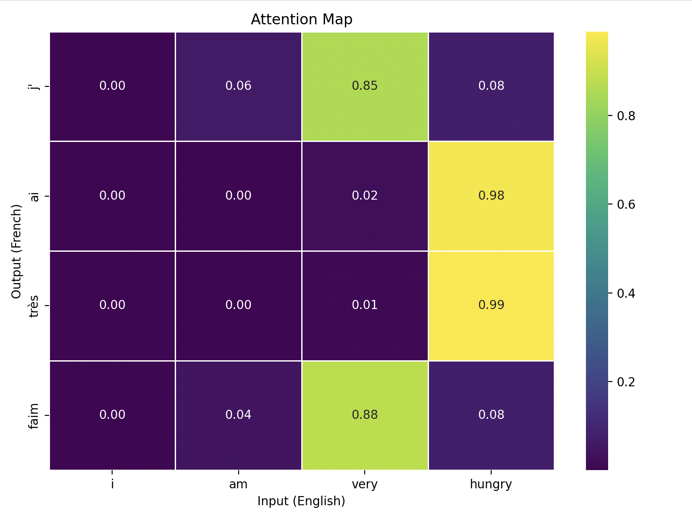
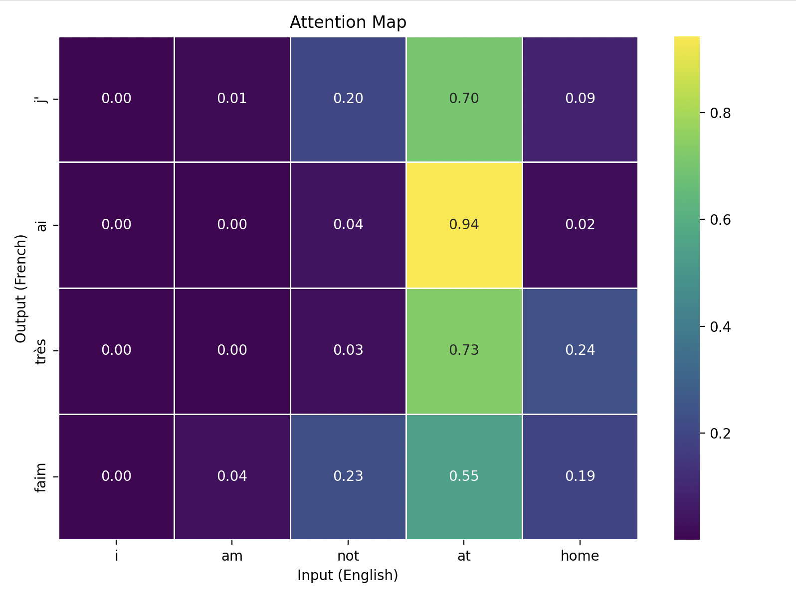

With such a tiny corpus, it's obvious that we won't get any better results than a vanilla RNN here. But the main thing I wanted to do here was understand how much each tokens were attending to each other. Here's some examples. 

### Example 1 

Here I wanted to translate "I am very hungry" and I got back a meaningful translation: "J'ai tres faim". 



If we take a look at this, it's easy to see that some words attended very strongly to some and lightly to all others, which we do expect with attention. However, it wasn't as direct as I expected. "Faim" attended to "very" with attention score 0.88 whereas we would've expected "faim" to point to "hungry". 

The translation still went through well though

```txt
❯ ./inference.sh i am very hungry
Translating: i am very hungry
Translation: j' ai très faim
```

### Example 2

Here I wanted to try a sentence that was totally out of context but using words from our vocabulary. I mixed the first two data points to make the sentence "I am not at home". It failed the translation but the attention map was cool to see (we could see that the tokens learned something). 

```txt
❯ ./inference.sh i am not at home
Translating: i am not at home
Translation: j' ai très faim
```



Again, we can see that the decoder is learning directional relevance between tokens even though it's not pointing exactly to the right contextual word. This makes sense because we trained on a tiny corpus and did not expose the words in a different manner. 